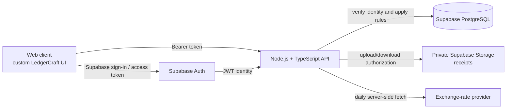
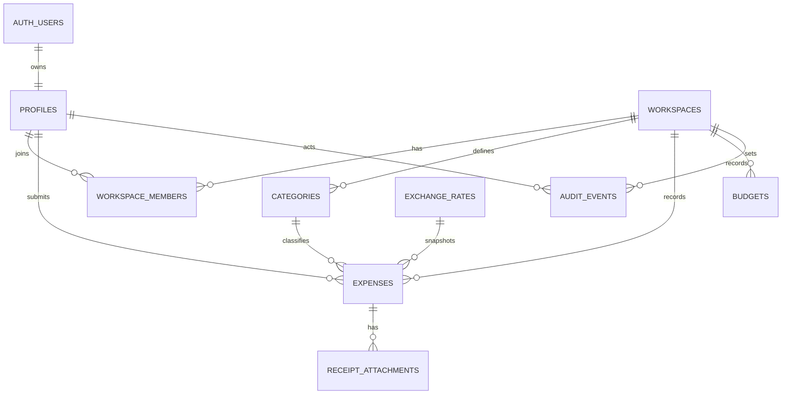

# LedgerCraft MVP: Product and Architecture Guide

> **Status:** Product decisions through 9 September 2026.
>
> **Audience:** Anybody learning how product decisions become system design, a Node.js + TypeScript API, and a secure PostgreSQL data model.

## 1. Why this document exists

LedgerCraft is a project used to show the connection between:

1. a product rule stated in plain language;
2. the data that must be stored to enforce it;
3. the API and authorization checks that protect it; and
4. the tests that prove it keeps working.

## 2. Product definition

**LedgerCraft is an expense-tracking and budgeting application for individuals and organisations.** A person has a personal workspace by default and may create or join organisation workspaces.

The MVP supports **NGN** (Nigerian naira) and **USD** (United States dollar). It records expenses in their original currency and presents dashboard and budget totals in each workspace's chosen reporting currency.

### Primary users

| User                | What they need                                                                                                                |
| ------------------- | ----------------------------------------------------------------------------------------------------------------------------- |
| Individual          | Record personal expenses and measure monthly spending against a budget.                                                       |
| Organisation member | Submit an expense with a receipt and see its outcome.                                                                         |
| Organisation admin  | Configure the workspace, approve expenses, control member visibility, manage the monthly budget, and void incorrect expenses. |

### In scope for the MVP

- Email/password authentication, account recovery, and a custom LedgerCraft user interface backed by Supabase Auth.
- Personal workspaces created automatically at sign-up.
- Organisation workspaces with Admin and Member roles. (Role-Based-Access-Control (RBAC))
- NGN and USD expenses, dashboards, and budgets.
- A daily external exchange-rate reference fetch.
- Expense categories and a single monthly overall budget per workspace.
- Receipt attachments.
- Organisation expense submission, approval, rejection, admin edits, voiding, and audit history.
- Bank/Card connections, payment initiaitions, card controls and bank reconciliations
- Admin-controlled sharing of selected approved expenses and of the overall budget summary.
- Email/password authentication (Custom Auth), account recovery, and a custom LedgerCraft user interface backed by Supabase Auth (O-Auth).
- Share budget with someone both personal and organization

### Explicitly out of scope for the MVP

- Person-to-person debt settlement or a Splitwise-style shared-expense splitter.
- Receipt OCR.
- AI forecasts, automated budget freezes, and predictive burn curves.
- Tax accounting, double-entry accounting, and formal accounting-period close workflows.
- More currencies than NGN and USD.
- A read-only Viewer role or per-member visibility exceptions.

## 3. Confirmed product decisions

| Area                          | Decision                                                                                                   | System consequence                                                            |
| ----------------------------- | ---------------------------------------------------------------------------------------------------------- | ----------------------------------------------------------------------------- |
| Workspace creation            | Sign-up creates one personal workspace. Organisation workspaces are created separately.                    | `workspaces.type` distinguishes `personal` and `organisation`.                |
| Organisation setup            | Ask only for workspace name and reporting currency. The creator becomes Admin.                             | The creation transaction makes the workspace and creator membership together. |
| Roles                         | MVP has Admin and Member roles only.                                                                       | A small role enum and straightforward access policies.                        |
| Organisation expense approval | A Member's expense must be submitted and approved by an Admin before it affects reports or budgets.        | Status workflow and approval fields are required.                             |
| Admin-created expenses        | Automatically approved.                                                                                    | The API records an auditable self-approval event.                             |
| Approved-expense edits        | The original submitter cannot edit after approval. Only an Admin can.                                      | Status-aware API authorization and before/after audit entries.                |
| Deletion                      | Approved expenses are never permanently deleted. Admins void them.                                         | `voided` status; no destructive delete endpoint.                              |
| Voided totals                 | Voided expenses are excluded from normal spending, budget, and dashboard totals, but remain in history.    | Operational queries use `status = 'approved'`.                                |
| Receipts                      | Optional for personal expenses; required before an organisation expense can be submitted or auto-approved. | Submission/approval validation checks for an attachment.                      |
| Expense visibility            | Members always see their own submissions. An Admin may publish an approved expense to all Members.         | `is_shared_with_members` on approved organisation expenses.                   |
| Budget visibility             | Admin chooses whether Members can see the workspace monthly budget summary.                                | `budget_visible_to_members` on the workspace or current budget policy.        |
| Budget model                  | One monthly overall budget per workspace, in its reporting currency.                                       | A unique budget per workspace/month; category budgets come later.             |
| FX source                     | Fetch from a free external provider.                                                                       | Scheduled server job and an immutable rate record/snapshot.                   |

## 4. The core concepts

### Workspace

A workspace is the boundary for ownership and authorization. A personal workspace has one owner; an organisation workspace can have many members.

Every workspace has:

- a name and URL-safe slug;
- a type: `personal` or `organisation`;
- a reporting currency: `NGN` or `USD`;
- support for recording expenses in either NGN or USD; and
- a monthly overall budget in its reporting currency, if the admin/owner sets one.

### Expense

An expense is a record of money spent. It retains its original amount and currency forever. If the workspace reports in another currency, the converted amount and the rate snapshot used for that conversion are saved with the expense.

For example:

```text
Original expense:       $120.00 USD
Workspace currency:     NGN
Saved reference rate:   1 USD = 1,480 NGN
Reporting amount:       ₦177,600.00 NGN
```

The current exchange rate must never silently rewrite a historical expense. This protects reports from changing merely because a provider published a new rate.

### Receipt attachment

The database stores receipt metadata. The binary file itself is stored in a private Supabase Storage bucket. A receipt inherits access from its parent expense; it is not a public file.

### Audit event

An audit event explains who performed an important action, on which record, when, and what changed. Audit history is a product feature for traceability; it is not, by itself, a claim of regulatory compliance.

## 5. Expense lifecycle

### Personal workspace

```text
Create expense ──> Approved ──> (Admin/owner may edit or void)
```

Personal receipts are optional. An approved personal expense counts toward spending and the current monthly budget unless it is voided.

### Organisation workspace: Member-created expense

```text
Draft ──> Submitted ──> Approved ──> Voided
                  └──> Rejected
```

- A Member may create or edit their own draft.
- A receipt is required to submit the expense.
- Submitted expenses do not affect standard reports or budgets.
- An Admin approves or rejects the submission.
- Only an approved expense affects standard reports and budgets.
- The submitting Member cannot edit an approved expense.
- An Admin may edit or void an approved expense. Both actions produce audit events.
- A voided expense remains readable in history but is excluded from normal calculations.

### Organisation workspace: Admin-created expense

```text
Create with receipt ──> Approved automatically ──> Voided
```

An Admin's expense still requires a receipt. The audit event should identify that it was automatically approved because the submitter was an Admin.

### Status transition table

| From      | To                | Who may act                | Requirement                                    |
| --------- | ----------------- | -------------------------- | ---------------------------------------------- |
| Draft     | Submitted         | Submitting Member or Admin | Organisation expense has at least one receipt. |
| Submitted | Approved          | Admin                      | Store approver and approval time.              |
| Submitted | Rejected          | Admin                      | Store reviewer, time, and optional reason.     |
| Approved  | Approved (edited) | Admin                      | Capture before/after values in the audit log.  |
| Approved  | Voided            | Admin                      | Store void reason, actor, and time.            |

No API route should hard-delete an approved expense.

## 6. System architecture

### Recommended boundary



The Node API is the home for LedgerCraft's business rules: status transitions, role checks, receipt requirements, budget calculations, audit records, and exchange-rate fetching.

Supabase owns identity and its Postgres database. Supabase Auth provides the user ID and session token; LedgerCraft provides the product-specific profile, workspace membership, roles, and permissions.

### Authentication: what “custom auth” means here

LedgerCraft may have a completely custom sign-in, sign-up, recovery, profile, and account-settings interface. It must not create a second password database.

| Responsibility                                                                                                 | Owner                                     |
| -------------------------------------------------------------------------------------------------------------- | ----------------------------------------- |
| Password hashing, password verification, password reset tokens, sessions, email verification, MFA capabilities | Supabase Auth                             |
| User profile, workspace creation, membership roles, approval rules, receipt authorization, audit events        | LedgerCraft Node API + application tables |

The API receives a Supabase access token, validates the user identity, then authorizes the requested LedgerCraft action. Secrets with database-wide access stay only on trusted server infrastructure and are never sent to the browser.

Supabase Auth uses JWTs and integrates with Postgres Row Level Security (RLS). Its managed auth users can be linked to an application-owned profile table using the stable primary-key user ID. [Supabase Auth](https://supabase.com/docs/guides/auth) [User management](https://supabase.com/docs/guides/auth/managing-user-data)

### Authorization model

The API must check authorization on every request. RLS should additionally protect any database tables or storage objects exposed through Supabase. RLS is not a substitute for application-level approval rules; it is a second protective boundary.

| Action                       | Personal owner | Organisation Admin                  | Organisation Member                                                 |
| ---------------------------- | -------------- | ----------------------------------- | ------------------------------------------------------------------- |
| View all workspace expenses  | Yes            | Yes                                 | Only own expenses and explicitly shared approved expenses           |
| Create expense               | Yes            | Yes                                 | Yes                                                                 |
| Submit organisation expense  | N/A            | Automatically approved with receipt | Yes, with receipt                                                   |
| Approve/reject submission    | N/A            | Yes                                 | No                                                                  |
| Edit approved expense        | Yes            | Yes                                 | No                                                                  |
| Void approved expense        | Yes            | Yes                                 | No                                                                  |
| Create/update monthly budget | Yes            | Yes                                 | No                                                                  |
| Invite/manage members        | N/A            | Yes                                 | No                                                                  |
| View audit history           | Yes            | Yes                                 | Only their own submission outcome, unless a later rule expands this |

### Storage access

Use a private `receipts` bucket, not a public bucket. Suggested object path:

```text
receipts/{workspace-id}/{expense-id}/{attachment-id}.{extension}
```

The path is an organizational aid, not authorization. Access is granted only after the API/RLS verifies that the caller can view the associated expense. The application should issue short-lived download URLs rather than save public URLs in the database.

Supabase Storage uses RLS policies for object access, and uploads require explicit `storage.objects` policies. [Storage access control](https://supabase.com/docs/guides/storage/security/access-control)

### Exchange-rate service

The system uses an adapter so that provider details do not leak throughout the codebase:

```ts
interface ExchangeRateProvider {
  getLatestRate(input: {
    base: "USD" | "NGN";
    quote: "USD" | "NGN";
  }): Promise<ExchangeRateQuote>;
}
```

Initial provider: ExchangeRate-API's free keyed plan. It supports NGN and USD and currently provides daily updates with a 1,500-request monthly allowance. The server fetches one USD-to-NGN rate daily—roughly 30 requests per month—and saves the provider response. [Supported currencies](https://www.exchangerate-api.com/docs/supported-currencies) [Provider plans](https://www.exchangerate-api.com/)

The dashboard must say **reference rate** and show the last update time. It must not call the rate “live”, a bank rate, a card rate, or a settlement rate. The provider describes its indicative rates as unsuitable for cross-currency settlement processing. [Rate data notes](https://www.exchangerate-api.com/docs/historical-data-requests)

## 7. Database architecture

### Design rules

1. Use PostgreSQL `uuid` primary keys.
2. Store money as integer minor units (`bigint`), never JavaScript floating-point numbers.
3. Store exchange rates as precise Postgres `numeric`, never JavaScript floating-point numbers.
4. Keep original amounts, currencies, and conversion snapshots immutable after creation. An admin correction is an audited edit; a cancellation is a void.
5. Store files in Storage and metadata in Postgres.
6. Enable and test RLS on every client-exposed table.
7. Use SQL migrations in version control. 

### Entity relationship overview



### Tables

#### `profiles`

Application-owned information about an authenticated person.

| Column                     | Type                              | Notes                                              |
| -------------------------- | --------------------------------- | -------------------------------------------------- |
| `id`                       | `uuid` PK, FK to `auth.users(id)` | Same stable identity as Supabase Auth user.        |
| `full_name`                | `text`                            | Required at profile completion.                    |
| `avatar_path`              | `text nullable`                   | Private/public policy to be determined separately. |
| `timezone`                 | `text nullable`                   | Useful for display and notification timing.        |
| `created_at`, `updated_at` | `timestamptz`                     | Server-managed timestamps.                         |

#### `workspaces`

| Column                      | Type          | Notes                                                |
| --------------------------- | ------------- | ---------------------------------------------------- |
| `id`                        | `uuid` PK     |                                                      |
| `name`                      | `text`        | Personal or organisation display name.               |
| `slug`                      | `text unique` | Generated unique URL-safe identifier.                |
| `type`                      | enum          | `personal` or `organisation`.                        |
| `reporting_currency`        | enum          | `NGN` or `USD`.                                      |
| `budget_visible_to_members` | `boolean`     | Admin-controlled, default `false` for organisations. |
| `created_by_profile_id`     | `uuid` FK     | Creator/owner.                                       |
| `created_at`, `updated_at`  | `timestamptz` |                                                      |

#### `workspace_members`

| Column         | Type          | Notes                          |
| -------------- | ------------- | ------------------------------ |
| `workspace_id` | `uuid` FK     | Part of composite primary key. |
| `profile_id`   | `uuid` FK     | Part of composite primary key. |
| `role`         | enum          | `admin` or `member`.           |
| `joined_at`    | `timestamptz` |                                |

For a personal workspace, the creator has an `admin` membership. That lets the authorization code use the same ownership checks for both workspace types.

#### `categories`

| Column         | Type            | Notes                                         |
| -------------- | --------------- | --------------------------------------------- |
| `id`           | `uuid` PK       |                                               |
| `workspace_id` | `uuid` FK       | Categories are workspace-specific.            |
| `name`         | `text`          | Unique within a workspace.                    |
| `color`        | `text nullable` | Display-only validated value.                 |
| `is_archived`  | `boolean`       | Preserve category history rather than delete. |

Seed a small editable category set during workspace creation, such as Food, Transport, Utilities, Software, Office, Travel, and Other.

#### `exchange_rates`

| Column                | Type              | Notes                                                 |
| --------------------- | ----------------- | ----------------------------------------------------- |
| `id`                  | `uuid` PK         |                                                       |
| `provider`            | `text`            | Example: `exchange-rate-api`.                         |
| `base_currency`       | enum              | `USD` or `NGN`.                                       |
| `quote_currency`      | enum              | `USD` or `NGN`.                                       |
| `rate`                | `numeric(24, 12)` | Quote units per one base unit.                        |
| `provider_updated_at` | `timestamptz`     | Timestamp reported by provider.                       |
| `fetched_at`          | `timestamptz`     | When LedgerCraft retrieved it.                        |
| `raw_response`        | `jsonb nullable`  | Useful for debugging; avoid storing secrets. |

Rates are append-only. A new fetch produces a new record rather than overwriting the previous rate.

#### `expenses`

| Column                     | Type                   | Notes                                                   |
| -------------------------- | ---------------------- | ------------------------------------------------------- |
| `id`                       | `uuid` PK              |                                                         |
| `workspace_id`             | `uuid` FK              | Tenant boundary.                                        |
| `category_id`              | `uuid` FK              | Category at recording time.                             |
| `submitted_by_profile_id`  | `uuid` FK              | Who created it.                                         |
| `merchant`                 | `text`                 | Required display name.                                  |
| `description`              | `text nullable`        | Optional explanation.                                   |
| `occurred_on`              | `date`                 | Date of the expense.                                    |
| `original_amount_minor`    | `bigint`               | Positive amount in original currency's minor units.     |
| `original_currency`        | enum                   | `NGN` or `USD`.                                         |
| `reporting_amount_minor`   | `bigint`               | Amount in workspace reporting currency using snapshot.  |
| `reporting_currency`       | enum                   | Snapshot of workspace reporting currency.               |
| `conversion_rate`          | `numeric(24, 12)`      | Saved conversion reference; `1` for same currency.      |
| `exchange_rate_id`         | `uuid nullable` FK     | Source record for cross-currency conversion.            |
| `status`                   | enum                   | `draft`, `submitted`, `approved`, `rejected`, `voided`. |
| `is_shared_with_members`   | `boolean`              | Only meaningful for approved organisation expenses.     |
| `approved_by_profile_id`   | `uuid nullable` FK     | Admin approver or creator for admin auto-approval.      |
| `approved_at`              | `timestamptz nullable` |                                                         |
| `rejection_reason`         | `text nullable`        |                                                         |
| `voided_by_profile_id`     | `uuid nullable` FK     |                                                         |
| `voided_at`                | `timestamptz nullable` |                                                         |
| `void_reason`              | `text nullable`        |                                                         |
| `created_at`, `updated_at` | `timestamptz`          |                                                         |

**Important query rule:** normal financial summaries include only `status = 'approved'`. Draft, submitted, rejected, and voided records are available only in the appropriate workflow/history views.

#### `receipt_attachments`

| Column                   | Type          | Notes                                    |
| ------------------------ | ------------- | ---------------------------------------- |
| `id`                     | `uuid` PK     | Used in the storage path.                |
| `expense_id`             | `uuid` FK     | Parent expense.                          |
| `bucket`                 | `text`        | Fixed value: `receipts`.                 |
| `storage_path`           | `text unique` | Private Storage object path.             |
| `original_filename`      | `text`        | Sanitized for display.                   |
| `mime_type`              | `text`        | Allowed types decided in implementation. |
| `size_bytes`             | `bigint`      | Enforce a configured maximum.            |
| `uploaded_by_profile_id` | `uuid` FK     |                                          |
| `created_at`             | `timestamptz` |                                          |

#### `budgets`

| Column                     | Type          | Notes                                        |
| -------------------------- | ------------- | -------------------------------------------- |
| `id`                       | `uuid` PK     |                                              |
| `workspace_id`             | `uuid` FK     |                                              |
| `period_start`             | `date`        | First day of the month.                      |
| `amount_minor`             | `bigint`      | In the workspace reporting currency.         |
| `currency`                 | enum          | Must equal the workspace reporting currency. |
| `created_by_profile_id`    | `uuid` FK     |                                              |
| `created_at`, `updated_at` | `timestamptz` |                                              |

Add a uniqueness constraint for `(workspace_id, period_start)`. Monthly spending is the sum of approved `reporting_amount_minor` entries whose `occurred_on` is in that month.

#### `audit_events`

| Column             | Type               | Notes                                           |
| ------------------ | ------------------ | ----------------------------------------------- |
| `id`               | `uuid` PK          |                                                 |
| `workspace_id`     | `uuid` FK          | Makes tenant-scoped queries efficient.          |
| `actor_profile_id` | `uuid nullable` FK | Nullable only for trusted system jobs.          |
| `entity_type`      | `text`             | Example: `expense`, `budget`, `membership`.     |
| `entity_id`        | `uuid`             | ID of changed record.                           |
| `action`           | `text`             | Example: `expense.submitted`, `expense.voided`. |
| `before`           | `jsonb nullable`   | Sanitized old state.                            |
| `after`            | `jsonb nullable`   | Sanitized new state.                            |
| `occurred_at`      | `timestamptz`      |                                                 |

Do not put access tokens, password material, signed URLs, or raw file contents in audit events.

### Essential indexes and constraints

- `workspace_members(workspace_id, profile_id)` primary key.
- `expenses(workspace_id, status, occurred_on)` for dashboards and budget totals.
- `expenses(submitted_by_profile_id, status, created_at desc)` for a Member's submissions.
- `expenses(workspace_id, is_shared_with_members, status, occurred_on desc)` for shared member views.
- `receipt_attachments(expense_id)`.
- `audit_events(workspace_id, occurred_at desc)`.
- `budgets(workspace_id, period_start)` unique.
- Check all money amounts are greater than zero where applicable.
- Check conversion rate is greater than zero.
- Check `reporting_currency` and budget currency are only `NGN` or `USD`.

## 8. API shape 

The final route names are an implementation choice. These resource-oriented examples expose the domain clearly:

| Method  | Route                                             | Purpose                                                                         |
| ------- | ------------------------------------------------- | ------------------------------------------------------------------------------- |
| `POST`  | `/v1/workspaces`                                  | Create an organisation workspace.                                               |
| `GET`   | `/v1/workspaces/:workspaceId`                     | Fetch workspace metadata the caller may access.                                 |
| `POST`  | `/v1/workspaces/:workspaceId/members/invitations` | Invite a member; implementation details still to be chosen.                     |
| `GET`   | `/v1/workspaces/:workspaceId/expenses`            | List only expenses visible to the caller.                                       |
| `POST`  | `/v1/workspaces/:workspaceId/expenses`            | Create a draft, personal approved expense, or admin auto-approved expense.      |
| `POST`  | `/v1/expenses/:expenseId/receipts`                | Request/upload a private receipt attachment.                                    |
| `POST`  | `/v1/expenses/:expenseId/submit`                  | Submit a Member's organisation expense after receipt validation.                |
| `POST`  | `/v1/expenses/:expenseId/approve`                 | Approve a submitted expense.                                                    |
| `POST`  | `/v1/expenses/:expenseId/reject`                  | Reject a submitted expense.                                                     |
| `PATCH` | `/v1/expenses/:expenseId`                         | Admin edit after approval; appropriate draft edits may be allowed to submitter. |
| `POST`  | `/v1/expenses/:expenseId/void`                    | Void an approved expense.                                                       |
| `POST`  | `/v1/expenses/:expenseId/share`                   | Publish an approved expense to all members.                                     |
| `GET`   | `/v1/workspaces/:workspaceId/budget`              | Get the current monthly budget if caller is allowed.                            |
| `PUT`   | `/v1/workspaces/:workspaceId/budget/:periodStart` | Create or update a monthly overall budget.                                      |
| `GET`   | `/v1/workspaces/:workspaceId/dashboard`           | Return totals derived from approved expenses only.                              |
| `GET`   | `/v1/workspaces/:workspaceId/audit-events`        | Admin/owner audit history.                                                      |

The API should use schema validation at its boundary (for example, Zod) and return a predictable error format. It must never accept a client-supplied role, approval status, reporting amount, or exchange rate as authoritative.

## 9. Security and reliability checklist

- [ ] Use Supabase Auth as the sole password/session authority; never create a second credential store.
- [ ] Verify the user identity before every protected API action.
- [ ] Authorize using workspace membership and role, not a workspace ID supplied by the browser alone.
- [ ] Enable RLS and least-privilege grants on every exposed application table and Storage object.
- [ ] Keep Supabase secret/service keys and exchange-rate API keys on the server only.
- [ ] Use a private receipts bucket with type and size validation.
- [ ] Generate attachment IDs server-side and prevent path traversal or client-controlled storage paths.
- [ ] Use precise integer/decimal money arithmetic; never JavaScript `number` for money math.
- [ ] Preserve original currency, amount, conversion rate, provider, and timestamp.
- [ ] Write audit events in the same database transaction as the business change when feasible.
- [ ] Make voiding idempotent and reject status transitions that are invalid.
- [ ] Rate-limit sign-in, recovery, attachment-upload initiation, and exchange-rate fetching endpoints.
- [ ] Test both allowed and denied authorization cases, including RLS policies.

## 10. Test scenarios we should implement

### Product rules

- A user receives one personal workspace at sign-up.
- An organisation creator becomes its Admin.
- A Member cannot submit an organisation expense without a receipt.
- An Admin-created organisation expense with a receipt is approved automatically.
- A submitted expense does not affect the dashboard or budget.
- An approved expense affects the monthly total in the reporting currency.
- A voided expense no longer affects normal totals but remains in history.
- A Member cannot edit an approved expense they submitted.
- An Admin edit adds an audit event containing safe before/after values.
- A Member sees their own expense, but not another Member's unshared expense.
- A Member can see a shared approved expense.
- A Member cannot download a receipt for an expense they cannot see.
- A USD expense in an NGN workspace uses its saved rate after newer rates are fetched.

### Security tests

- Unauthenticated users cannot read or write application data.
- A Member of workspace A cannot access workspace B by changing an ID in the URL.
- A Member cannot call the approve, reject, void, budget-update, or membership-management routes.
- The browser cannot obtain server-only keys.
- Storage policies deny a direct object read when the caller lacks expense access.
- Invalid file type, empty file, oversized file, and mismatched MIME type are rejected.

## 11. Build order

1. **Project foundation** — initialize Node.js + TypeScript, linting, formatting, test runner, environment validation, and CI.
2. **Supabase foundation** — create project configuration, SQL migrations, `profiles`, `workspaces`, and `workspace_members`; write RLS tests.
3. **Identity boundary** — implement Supabase token verification, profile creation, and automatic personal-workspace provisioning.
4. **Organisation domain** — create organisation workspace, Admin/Member membership, and invitation flow.
5. **Expense domain** — categories, drafts, required organisation receipts, submission, approval/rejection, sharing, admin edits, and voiding.
6. **Storage** — private receipt bucket, object policies, upload/download flow, cleanup strategy, and tests.
7. **FX and budgets** — daily rate job, rate snapshots, monthly reporting-currency budget, dashboard calculations.
8. **Hardening** — audit events, rate limits, observability, full authorization test suite, and production configuration review.

Each step should leave the project runnable and tested. Avoid building the dashboard before the approval, currency, and authorization rules it depends on are correct.

## 12. Implementation decisions still open

These are intentionally not invented in this document. Choose them with goals, team comfort, and deployment target in mind.

| Decision                                                                                | Why it matters                                                                        |
| --------------------------------------------------------------------------------------- | ------------------------------------------------------------------------------------- |
| HTTP framework: Fastify, Express, or NestJS                                             | Shapes routing, validation, dependency management, and lessons.                       |
| Database access style: Supabase JS per-user context, SQL-first repository layer, or ORM | Changes how RLS context, migrations, transactions, and query work.           |
| Client framework                                                                        | The repository currently contains no frontend project.                                |
| Email configuration and invitation delivery                                             | Supabase Auth needs appropriate redirect URLs and mail configuration.                 |
| Accepted receipt types and maximum upload size                                          | Needed for the final Storage bucket policy and input validation.                      |
| Organisation invitation/acceptance experience                                           | Needed before members can join a workspace.                                           |
| Budget calendar/time-zone semantics                                                     | Define whether a month follows UTC or workspace/user local time.                      |
| Rate-fetch scheduler and failure alerting                                               | Needed to run the daily provider job reliably in the selected deployment environment. |
| Export and workspace archival rules                                                     | Mentioned in designs but not yet a confirmed MVP requirement.                         |

## 13. Terms used consistently

| Term               | Meaning                                                                                               |
| ------------------ | ----------------------------------------------------------------------------------------------------- |
| Original currency  | Currency in which the user actually paid, NGN or USD.                                                 |
| Reporting currency | The currency used for a workspace's budget and converted totals.                                      |
| Reference rate     | Saved external indicative conversion rate used for reporting. It is not a bank/card/settlement quote. |
| Draft              | An unsubmitted expense not included in financial totals.                                              |
| Submitted          | A Member's expense waiting for an Admin decision; not included in normal totals.                      |
| Approved           | Expense included in normal reports and budget calculations.                                           |
| Rejected           | Expense not approved; retained for the submitter and workflow history.                                |
| Voided             | Formerly approved expense preserved for audit, but excluded from normal totals.                       |
| Shared             | An approved organisation expense intentionally visible to all Members.                                |

---

### Sources consulted for this draft

- [Supabase Auth documentation](https://supabase.com/docs/guides/auth)
- [Supabase user management guidance](https://supabase.com/docs/guides/auth/managing-user-data)
- [Supabase Row Level Security guidance](https://supabase.com/docs/guides/database/postgres/row-level-security)
- [Supabase Storage access-control guidance](https://supabase.com/docs/guides/storage/security/access-control)
- [ExchangeRate-API supported currencies](https://www.exchangerate-api.com/docs/supported-currencies)
- [ExchangeRate-API plans](https://www.exchangerate-api.com/)
- [ExchangeRate-API rate-data notes](https://www.exchangerate-api.com/docs/historical-data-requests)
